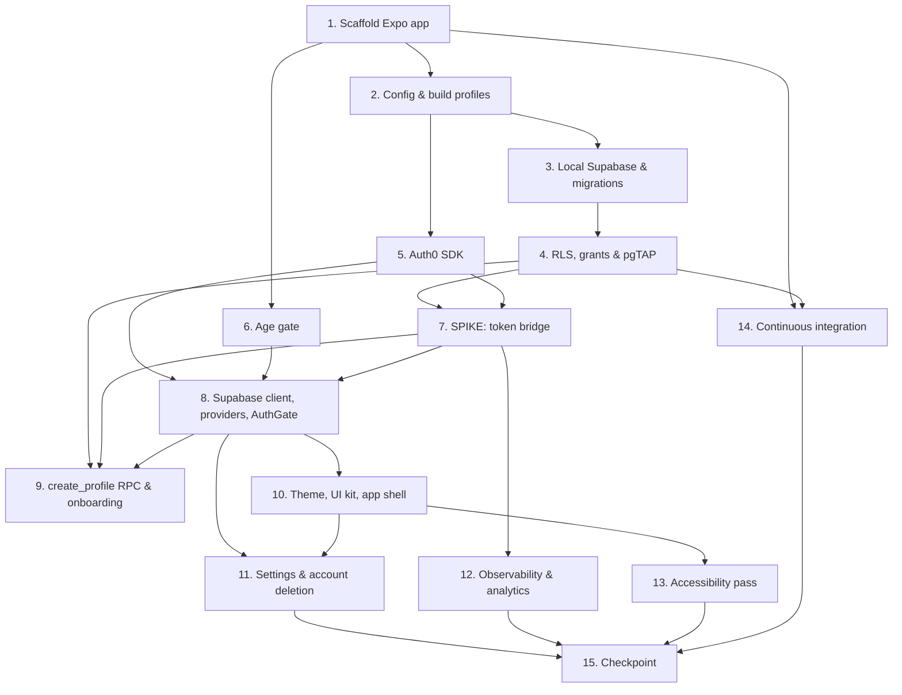

# Implementation Plan

Foundation, Auth, and Data

## Overview

This plan builds the shared foundation for the app: an Expo + Expo Router project wired to Auth0 for identity and Supabase for data, with row-level security enforced end to end. Most work is sequential, each step building on the project scaffold, configuration, and database before auth and UI are layered on top. Task 7, the Auth0-to-Supabase token-bridge spike, is the key gating task: its outcome determines the Supabase client wiring and all RPC/pgTAP identity tests, so tasks 8, 9, and 12 wait on it.

## Task Dependency Graph



```json
{
  "waves": [
    { "wave": 1, "tasks": ["1"] },
    { "wave": 2, "tasks": ["2", "6"] },
    { "wave": 3, "tasks": ["3", "5"] },
    { "wave": 4, "tasks": ["4"] },
    { "wave": 5, "tasks": ["7", "14"] },
    { "wave": 6, "tasks": ["8"] },
    { "wave": 7, "tasks": ["9", "10", "12"] },
    { "wave": 8, "tasks": ["11", "13"] },
    { "wave": 9, "tasks": ["15"] }
  ]
}
```

## Tasks

- [x] 1. Scaffold the Expo app
  - Create Expo TypeScript app with Expo Router; enable TypeScript strict mode
  - Add ESLint, Prettier, Jest + React Native Testing Library; add npm scripts (start, lint, typecheck, test, validate:content)
  - Create the folder layout from structure.md with placeholder README files
  - _Requirements: 1.1_

- [x] 2. Configuration and build profiles
  - Add src/lib/config.ts (Zod env validation) and .env.example listing variable NAMES only
  - Add app.config.ts, eas.json with development, preview, production profiles; set bundle identifier and Android package placeholders
  - Create an iOS development build and confirm it launches
  - .env.example lists CLIENT EXPO_PUBLIC_* variable names only. Server-only secrets (MARKET_DATA_API_KEY, AUTH0_MGMT_DOMAIN, AUTH0_MGMT_CLIENT_ID, AUTH0_MGMT_CLIENT_SECRET, CRON_SECRET, Supabase service-role key) MUST NOT appear in it.
  - _Requirements: 1.2, 1.3_

- [x] 3. Local Supabase and baseline migration
  - Initialize supabase/, config.toml; `supabase start`
  - Write migrations ONLY for the tables this spec owns: app_config (3.1), profiles + consents (3.2), instruments (3.3, the instruments table only — it is the FK target later specs need), paper_accounts + user_stats (3.4 account tables only), events (3.6). Do NOT create positions, orders, watchlist_items, portfolio_snapshots, quotes, quote_bars, market_holidays, or any lessons/progression tables — they belong to later specs or FK tables not created here.
  - Seed app_config; generate types to src/types/db.ts
  - _Requirements: 6.1_

- [x] 4. Row-level security, grants, and pgTAP tests
  - Add RLS policies, revokes, and grants exactly as section 4 of the DB reference
  - Write pgTAP tests: cross-user isolation, anon denied, direct writes denied, events not selectable
  - Add a pgTAP helper (supabase/tests/_helpers.sql) that sets request.jwt.claims (sub + role=authenticated) per the design's 'Faking the Auth0 identity in pgTAP' note; use it in the isolation, anon, and direct-write tests. Confirm and record the exact claim/GUC key the local stack exposes to auth.jwt().
  - _Requirements: 6.2, 6.3, 6.4, 6.5_

- [x] 5. Auth0 SDK integration
  - Install react-native-auth0 with its Expo config plugin; configure domain and clientId from config
  - Implement src/lib/auth0.ts (AuthProvider, useSession) with login, logout, getAccessToken
  - Rebuild the development build (config plugin changes need a prebuild)
  - _Requirements: 3.1, 3.2, 3.3, 3.5_

- [x] 6. Age gate
  - Implement computeAge and unit tests (month boundaries, last-day-of-month rule, leap years)
  - Build age-gate and age-block screens, device flag, onboarding in-memory store
  - _Requirements: 2.1, 2.2, 2.3, 2.4_

- [x] 7. SPIKE: Auth0 to Supabase token bridge
  - Add a throwaway debug screen that logs in, decodes the token the app sends (not displayed in release builds), and calls `select public.current_user_id()` via rpc or a test function
  - Confirm role = "authenticated" and sub are present; if not, adjust the Auth0 Action and token choice
  - Record the decision in tech.md; delete the debug screen
  - NOTE: this spike is a prerequisite for tasks 8, 9, and 12. Its outcome (which token carries role + sub) determines the Supabase client wiring and all RPC/pgTAP identity tests. Do these tasks after the spike resolves.
  - _Requirements: 4.1, 4.2, 4.3, 4.4_

- [x] 8. Supabase client, providers, and AuthGate
  - Implement src/lib/supabase.ts with accessToken callback; add QueryClientProvider and ThemeProvider
  - Implement AuthGate routing (age block, welcome, onboarding, tabs)
  - Clear Query cache and stores on logout
  - _Requirements: 3.4, 3.5, 4.1_

- [x] 9. create_profile RPC and onboarding UI
  - Add migration for create_profile (section 5.1) and grants; pgTAP tests (under 13 rejected, idempotent, creates account/stats/consents, username rules)
  - Implement username generator with reviewed word lists and unit tests
  - Build onboarding screen (shuffle username, terms checkbox, continue) and error handling for username_taken and under_min_age
  - _Requirements: 5.1, 5.2, 5.3, 5.4, 5.5, 5.6, 5.7_

- [x] 10. Theme, UI kit, and app shell
  - Implement theme tokens (light/dark) and base components (Button, Card, Text, Screen, StateView, LockedState, Toast)
  - Build the four-tab shell with locked/empty states
  - _Requirements: 7.1, 7.2, 7.3, 7.4_

- [x] 11. Settings and account deletion
  - Build settings screens, legal links (placeholder URLs from config), delete-account confirmation UI
  - Implement the delete-account Edge Function (JWT check with jose, cascade delete, Auth0 Management API delete); set verify_jwt = false in config.toml
  - Test against the dev project with a throwaway account
  - _Requirements: 8.1, 8.2, 8.3, 8.4_

- [x] 12. Observability and analytics plumbing
  - Add Sentry with sendDefaultPii false and scrubbing; add an error boundary
  - Add log_events RPC (event-name allowlist) with pgTAP tests; implement src/lib/analytics.ts queue and flush
  - Log session_start and onboarding_completed
  - Define the event-name allowlist once in src/features/progress/analytics-events.ts and mirror the same list in the log_events RPC migration; reject unknown names on both sides.
  - _Requirements: 9.1, 9.2, 9.3, 9.4_

- [x] 13. Accessibility pass
  - Add labels/roles, test with larger text and VoiceOver, support reduce-motion, check contrast
  - _Requirements: 10.1, 10.2, 10.3, 10.4_

- [x] 14. Continuous integration
  - Add GitHub Actions: install, lint, typecheck, unit tests, `supabase start` + `supabase test db`
  - _Requirements: 1.4_

- [x] 15. Checkpoint
  - Run the full manual device test (signup, onboarding, tabs, logout, login, delete account); fix defects; update steering files with any decisions made

## Notes

- The spec files (requirements.md, design.md, tasks.md) live under this feature's spec folder.
- The schema source of truth is `docs/db-and-api-reference.md`; migrations and RLS policies must match it.
- Expo, EAS, and React Native APIs must be verified against the SDK 57 docs before coding — do not rely on remembered APIs.
- Later specs add the remaining tables (positions, orders, watchlist_items, portfolio_snapshots, quotes, quote_bars, market_holidays, and the lessons/progression tables); this spec only creates the tables it owns.
