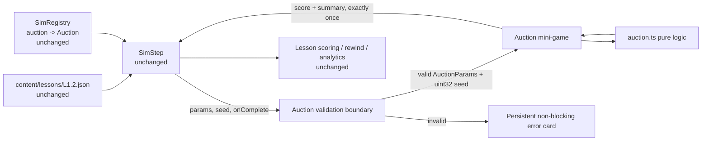
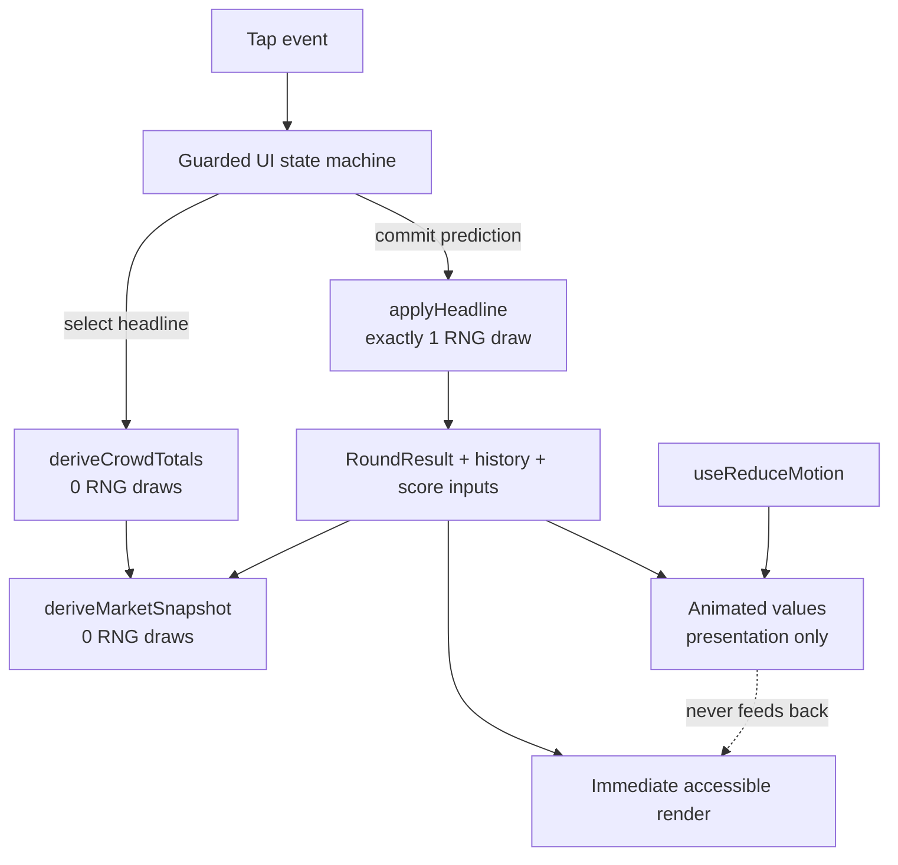
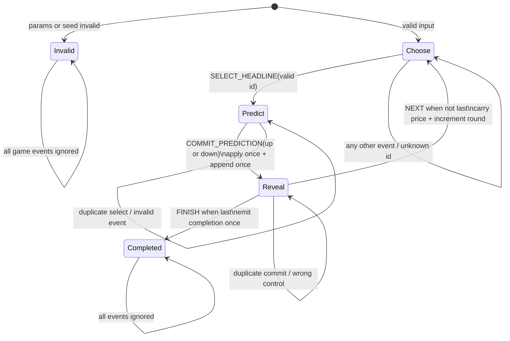

# Design Document: Interactive Auction Room

## Overview

This feature enhances the existing L1.2 `auction` simulation into a focused, mobile-first mini-game about price discovery. The learner plays one of two to four fictional rare-item headline cards, studies a visible buyer/seller crowd and market balance, locks an up/down prediction, and then sees a deterministic price reaction. The reveal combines a price-ticker movement, signed price change, market explanation, and round progress without changing lesson-engine behavior.

The implementation remains inside the existing auction boundary:

- Pure domain logic stays in `src/features/lessons/sims/auction.ts`.
- React Native presentation and interaction stay in `src/features/lessons/components/sims/Auction.tsx` (with small colocated presentational components if extraction improves readability).
- The public component still accepts only `SimComponentProps`: `params`, `seed`, and `onComplete`.
- `SIM_REGISTRY.auction`, `SimStep`, lesson scoring, rewind, analytics, content schema `simId`, and the lesson player remain unchanged.
- `content/lessons/L1.2.json` remains unchanged and valid.
- The simulation performs no network requests and triggers no haptics.

The auction is explicitly educational: it uses a fictional rare collectible, continuously shows “Simulation · No real money,” and labels its prices as simulated rather than live quotes. Bid, ask, and order-book depth are an understandable visualization derived from demand, supply, and the current simulated price; they are not presented as an exchange-grade matching engine.

### Goals

- Make demand, supply, bid, ask, and price discovery visible in every round.
- Preserve the existing price formula and seeded price path for existing valid content.
- Keep one and only one seeded RNG draw for each applied round.
- Make headline selection and prediction commitment explicit and resistant to duplicate taps.
- Keep all scoring and replay logic deterministic and testable outside React.
- Provide useful static behavior when reduced motion is enabled or native animation timing is unavailable.
- Fail locally and safely for invalid params or seed without crashing the lesson player or falsely completing the sim.

### Non-goals

- Building a real exchange, matching orders, or modeling executable liquidity.
- Adding real securities, real tickers, live quotes, trading, money, or financial advice.
- Changing the lesson engine, route structure, scoring aggregation, completion flow, rewind queue, or analytics.
- Persisting an in-progress auction independently of the existing lesson session.
- Adding a gesture system, haptics, networking, Reanimated, or another animation/testing dependency.

### Research findings and design consequences

- The installed `expo` major is 57. The [Expo SDK 57 reference](https://docs.expo.dev/versions/v57.0.0/) maps SDK 57 to React Native 0.86, matching this repository’s `react-native` dependency.
- [Expo animation guidance](https://docs.expo.dev/develop/user-interface/animation.md) identifies React Native’s built-in Animated API as available in Expo projects and positions Reanimated for more advanced animation. This mini-game needs only short opacity/transform effects, so core `Animated` is sufficient and no dependency is added.
- The [React Native 0.86 Animated reference](https://reactnative.dev/docs/0.86/animated) supports persistent `Animated.Value` objects, timing animations, interpolation, cleanup, and the native driver for opacity and transforms. Numeric auction values remain ordinary React/domain state; animation never computes them.
- The [React Native 0.86 AccessibilityInfo reference](https://reactnative.dev/docs/0.86/accessibilityinfo) provides reduced-motion queries/events and screen-reader announcement methods. The implementation reuses the repository’s existing `useReduceMotion` hook and keeps reveal text persistently rendered even if an announcement cannot be posted.
- The project already uses `jest-expo` and React Native Testing Library, consistent with [Expo’s Jest testing guidance](https://docs.expo.dev/develop/unit-testing.md). Existing test infrastructure is sufficient.

Content from documentation links above is paraphrased for licensing compliance.

### Approved requirement interpretations

| Tension | Design resolution |
|---|---|
| Throwing parser versus non-blocking UI | `parseAuctionParams` remains the strict throwing API for callers and tests. A new `safeParseAuctionParams` returns a discriminated result for the component. The component separately validates `seed` as a finite integer in `0..4,294,967,295`; any failure renders an in-card error state and never invokes `onComplete`. |
| Numeric bounds and existing content | Baseline demand/supply become integers in `0..1,000,000`; headline deltas become integers in `-1,000,000..1,000,000`; headline count becomes `2..4`. Applied totals use `clamp(base + delta, 0, 1,000,000)`, satisfying the displayed-total range. Current L1.2 values remain valid and do not hit either clamp. |
| Optional market-depth field versus required market visibility | `showMarketDepth` is an optional boolean defaulting to `true`. Bid/ask and the proportional buy/sell order-book strip always remain visible. The flag controls only the expanded three-level illustrative depth rows. Thus omitted L1.2 content gets the full experience, while an authored `false` can use the compact baseline without suppressing required bid/ask or relative sides. |
| Formula compatibility versus richer market data | `applyHeadline` retains the existing algebra and consumes exactly one `rng()` value even when noise is zero. Crowd totals and market-depth derivation are pure and consume no RNG, so existing seeded price paths remain unchanged for existing inputs. |
| Missing prediction versus mandatory UI choice | `AuctionChoice.prediction` becomes optional for pure replay and grading. An absent value is always incorrect. The UI state machine has no transition from prediction to reveal without an `up` or `down` value, so a live session never creates a missing prediction. |
| Duplicate events versus exact live/oracle replay | A guarded state machine accepts each headline selection, prediction commit, round advance, and finish event only in its valid phase. Synchronous refs guard against React event batching. A commit creates exactly one result/history record; finish emits one completion outcome. |
| Animation versus deterministic domain state | `Animated.Value` instances and reduced-motion state are presentation-only. The computed result is committed and rendered before animation starts; animation callbacks do not advance rounds, draw RNG, grade predictions, or call `onComplete`. Reduced motion snaps values to their final visual state. |

## Architecture

### System context and unchanged boundaries



`Auction` is the only public component. Validation is intentionally split from the game body so hooks that allocate RNG and animation values mount only for valid input:

```tsx
export function Auction(props: SimComponentProps) {
  const validation = validateAuctionInput(props.params, props.seed);
  if (!validation.success) return <AuctionErrorState message={validation.message} />;
  return <AuctionGame params={validation.params} seed={validation.seed} onComplete={props.onComplete} />;
}
```

`AuctionGame` is private and does not alter the shared contract. No route, provider, native project, or lesson-engine changes are required.

### Domain and presentation split



The pure layer owns validation, total clamping, price calculation, quote/depth derivation, direction, and scoring. The component owns phase guards, taps, accessible labels/announcements, and visual animation. Presentation can be disabled entirely without changing any domain output.

### Per-round data flow

1. A valid round starts with the carried `priceCents` and baseline demand/supply.
2. `deriveMarketSnapshot` produces the initial bid, ask, spread, proportional order-book strip, and optional depth levels without consuming RNG.
3. The learner taps one headline. The state machine locks that headline for the round, computes clamped preview demand/supply, updates crowd/balance/depth immediately, and enters `predict`.
4. The learner taps exactly one direction. The commit guard records it synchronously, calls `applyHeadline` once, and enters `reveal` with the new price and a single history record.
5. The UI immediately renders final numeric values, signed whole-cent change, actual direction, and a concise explanation. A presentation-only animation starts after the result exists.
6. “Next round” carries the revealed price forward and resets crowd totals to the authored baselines. “Finish lab” computes the outcome from committed history and invokes `onComplete` once.
7. A replay of the same headline/prediction history through `scoreAuction(params, choices, mulberry32(seed))` produces the same prices, correct count, and score.

### State machine



The component uses a discriminated state plus a synchronously updated `stateRef`. Event handlers read and update that ref before scheduling React state, preventing two taps in the same render batch from both passing a stale phase check. Prediction controls are disabled/removed as soon as commit begins. A `completionSentRef` is set before invoking `onComplete`; `Completed` has no outgoing transition. These two guards provide both logical and React-batching protection.

| Phase | Required data | Accepted event | Domain effect | Rejected-event behavior |
|---|---|---|---|---|
| `choose` | round, current price, baseline snapshot | `SELECT_HEADLINE(id)` | Resolve known headline, preview clamped crowd totals, enter `predict` | No-op; unknown id is surfaced by pure logic if called directly |
| `predict` | selected headline and preview snapshot | `COMMIT_PREDICTION(direction)` | Lock direction, call `applyHeadline` once, append one record, update current price, enter `reveal` | No-op; original selection/prediction is retained |
| `reveal` | one complete round record | `NEXT` on non-final round | Increment round, clear round-only fields, restore baseline crowd totals | No-op |
| `reveal` | one complete final record | `FINISH` | Compute clamped outcome, enter `completed`, emit one completion effect | No-op after first finish |
| `completed` | final history/outcome | none | None | All events no-op |
| `invalid` | safe validation issue | none | None | All events no-op and no completion |

### Price and market derivations

#### Crowd totals

For each round, authored headline deltas apply to baseline values rather than accumulating across rounds, preserving existing auction behavior:

```text
demand = clamp(baseDemand + headline.demandDelta, 0, 1_000_000)
supply = clamp(baseSupply + headline.supplyDelta, 0, 1_000_000)
```

#### Price update and RNG budget

`applyHeadline` performs the following in this order:

```text
total = demand + supply
imbalance = total == 0 ? 0 : (demand - supply) / total
u = rng()                                      // exactly one draw
noiseFraction = (2 * u - 1) * params.noise
noiseCents = priceCents * noiseFraction
rawNext = priceCents * (1 + sensitivity * imbalance) + noiseCents
priceAfterCents = max(1, round(rawNext))
direction = priceAfterCents >= priceCents ? "up" : "down"
```

This is algebraically identical to the current implementation’s `price * (1 + sensitivity * imbalance + noiseFraction)`. Calling `rng()` even when `noise` is zero preserves the established one-draw-per-round stream. A zero price change deterministically resolves to `up`.

#### Indicative bid, ask, and depth

`deriveMarketSnapshot` is a deterministic educational projection, not an order matcher. It accepts only a positive whole-cent price and bounded integer crowd totals. Invalid/unavailable inputs return `null` so the UI can show placeholders without mutating the round.

```text
total = demand + supply
imbalance = total == 0 ? 0 : (demand - supply) / total
halfSpreadCents = max(1, round(priceCents * (0.0025 + 0.0025 * abs(imbalance))))
bidCents = max(1, priceCents - halfSpreadCents)
askCents = max(bidCents, priceCents + halfSpreadCents)
spreadCents = askCents - bidCents
buyFraction = total == 0 ? 0 : demand / total
sellFraction = total == 0 ? 0 : supply / total
tickCents = max(1, round(priceCents * 0.001))
```

The spread is narrow near balance and widens modestly with stronger disagreement. Integer rounding and the final `max` guarantee `askCents >= bidCents >= 1`.

Each side is split into three illustrative levels whose quantities sum exactly to that side total:

```text
near = ceil(sideTotal * 0.50)
middle = min(sideTotal - near, ceil(sideTotal * 0.30))
far = sideTotal - near - middle
```

Buy prices are `bid`, `max(1, bid - tick)`, and `max(1, bid - 2*tick)`; sell prices are `ask`, `ask + tick`, and `ask + 2*tick`. Bar widths use a common scale of `max(demand, supply, 1)`, so buy/sell visual size remains proportional across sides. At zero total, both fractions and all quantities are zero and the accessible label says there are no resting buyers or sellers. The function has no RNG parameter and therefore cannot advance the seed.

### Animation architecture

A reveal creates its complete domain result synchronously. A subsequent effect maps direction to deterministic visual targets:

- `up`: a short positive vertical ticker offset returning to zero plus a subtle opacity pulse.
- `down`: the same fixed-distance offset in the opposite direction.
- no cent change: opacity pulse only, while domain direction remains the deterministic tie value `up`.

Persistent final price and explanation text are in the tree immediately; no counting animation is used. `Animated.Value` instances are stable component-local presentation objects. Only opacity and transform are animated, allowing `useNativeDriver: true`. Effects stop active animations during cleanup or a new reveal.

When `useReduceMotion()` returns true, the effect stops any running animation and sets every value directly to its final state. Controls and text are identical to the animated path. Animation completion callbacks perform no domain transition, so a missing native animation clock in Jest cannot block or alter the game.

### Accessibility architecture

- Every action is a shared `Button`/`Pressable` with `accessibilityRole="button"`, a non-empty label, a minimum tap target, and an accurate disabled/selected state.
- Headline labels include the full headline; the selected card is retained in the prediction phase and marked selected.
- Prediction labels explicitly say “Predict the price will go up/down.” Once committed, controls cannot change the value.
- Each phase exposes one active accessible header: “Choose a headline,” “Make your prediction,” or “Round result.”
- “Round N of M” is persistent accessible text.
- Buyer/seller totals, the balance meter, bid/ask meanings, spread, and depth have concise grouped labels; visual color is never the only direction cue.
- Reveal copy is always persistent accessible text and includes previous price, new price, signed cent change, actual direction, and why the imbalance moved it.
- The reveal text uses a polite live region where supported. On platforms requiring an imperative announcement, `AccessibilityInfo.announceForAccessibilityWithOptions(..., { queue: true })` (or `announceForAccessibility`) is called once per revealed round and guarded by `try/catch`; failure does not remove the persistent text.
- Reduced motion follows the existing `useReduceMotion` hook. Dynamic type is inherited from the shared `Text` component without capping font scale.
- Layout wraps headline and prediction controls and uses text labels alongside icons/arrows for cross-platform readability.

### Performance characteristics

- Runtime work is `O(rounds)` for a complete replay and `O(1)` per interaction.
- The crowd uses a fixed small set of illustrative buyer/seller avatars; it never renders one node per demand/supply unit.
- At most four headline controls and six depth rows render, so virtualization is unnecessary.
- Market snapshots are pure, cheap, and memoized by `priceCents`, `demand`, and `supply` in the component.
- Numeric state updates immediately; a visual animation never delays the 500 ms display requirements.
- Native-driven opacity/transform animations avoid frame-by-frame React renders.
- No interval, polling loop, network request, haptic call, system-clock read, or ambient randomness is introduced.

## Components and Interfaces

### Pure logic API (`sims/auction.ts`)

The current public functions remain, with bounded schemas and additive helpers:

```ts
import type { Rng } from '../rng';
import type { ZodError } from 'zod';

export const AUCTION_DIRECTIONS = ['up', 'down'] as const;
export type AuctionDirection = (typeof AUCTION_DIRECTIONS)[number];

export interface AuctionHeadline {
  id: string;
  text: string;
  demandDelta: number; // integer -1_000_000..1_000_000
  supplyDelta: number; // integer -1_000_000..1_000_000
}

export interface AuctionParams {
  startPriceCents: number; // positive safe integer
  baseDemand: number;      // integer 0..1_000_000
  baseSupply: number;      // integer 0..1_000_000
  sensitivity: number;     // 0..1
  noise: number;           // 0..0.1, default 0.01
  headlines: AuctionHeadline[]; // 2..4
  rounds: number;          // positive integer
  showMarketDepth: boolean; // default true
}

export type SafeAuctionParamsResult =
  | { success: true; data: AuctionParams }
  | { success: false; error: ZodError };

/** Strict API retained for pure callers and tests. */
export function parseAuctionParams(params: unknown): AuctionParams;

/** Non-throwing API used at the React boundary. */
export function safeParseAuctionParams(params: unknown): SafeAuctionParamsResult;

/** Runtime seed contract for the component boundary. */
export function isValidAuctionSeed(seed: unknown): seed is number;

export interface AuctionTotals {
  demand: number;
  supply: number;
}

export function deriveCrowdTotals(
  params: AuctionParams,
  headline: AuctionHeadline,
): AuctionTotals;

export interface MarketDepthLevel {
  priceCents: number;
  quantity: number;
  relativeSize: number; // 0..1 against common side scale
}

export interface AuctionMarketSnapshot {
  bidCents: number;
  askCents: number;
  spreadCents: number;
  imbalance: number;    // -1..1
  buyFraction: number;  // 0..1
  sellFraction: number; // 0..1
  buyLevels: readonly MarketDepthLevel[];  // nearest first
  sellLevels: readonly MarketDepthLevel[]; // nearest first
}

export function deriveMarketSnapshot(
  priceCents: number,
  demand: number,
  supply: number,
): AuctionMarketSnapshot | null;

export interface AuctionRoundResult {
  priceBeforeCents: number;
  priceAfterCents: number;
  direction: AuctionDirection; // zero change resolves to up
  demand: number;
  supply: number;
}

/** Calls rng exactly once for every invocation that applies a round. */
export function applyHeadline(
  priceCents: number,
  headline: AuctionHeadline,
  params: AuctionParams,
  rng: Rng,
): AuctionRoundResult;

export interface AuctionChoice {
  headlineId: string;
  prediction?: AuctionDirection; // missing is supported only by pure grading
}

export interface AuctionResult {
  rounds: AuctionRoundResult[];
  correct: number;
  total: number;
  score: number;
  finalPriceCents: number;
  summary: string;
}

export function scoreAuction(
  params: AuctionParams,
  choices: readonly AuctionChoice[],
  rng: Rng,
): AuctionResult;
```

`scoreAuction` continues to throw an error containing the unknown id when a choice references a missing headline. It applies every provided headline, including records with an absent prediction, so replay consumes one draw per played round. A missing prediction never increments `correct`. An empty choice list produces total `0`, score `0`, and the starting final price. Score calculation is centralized as `clamp(round(correct / total * 100), 0, 100)`, with zero returned for total zero.

### Component API and private boundaries

```ts
// Public and unchanged
export function Auction({ params, seed, onComplete }: SimComponentProps): React.ReactElement;

type AuctionInputValidation =
  | { success: true; params: AuctionParams; seed: number }
  | { success: false; message: string };

/** Private boundary helper composed from safeParseAuctionParams + isValidAuctionSeed. */
function validateAuctionInput(params: unknown, seed: unknown): AuctionInputValidation;

interface AuctionGameProps {
  params: AuctionParams;
  seed: number; // already validated uint32
  onComplete: SimComponentProps['onComplete'];
}

interface AuctionErrorStateProps {
  message: string; // friendly, stable copy; no raw content dump
}
```

The public `Auction` owns safe input validation. `AuctionGame` owns one `mulberry32(seed)` instance, session state, synchronous guards, history, and completion. Presentational children receive values and callbacks only; none imports RNG or calls `onComplete`.

### UI decomposition

| Component | Responsibility | Domain authority |
|---|---|---|
| `Auction` | Safe params/seed boundary; choose error or valid game subtree | None |
| `AuctionGame` | Guarded state machine, one RNG instance, history, scoring outcome, completion-once guard | Session orchestration only |
| `AuctionHeader` | Fictional rare-item framing, simulation/no-money label, simulated quote label, round progress | None |
| `MarketStage` | Current price, fixed-size buyer/seller crowd, totals, balance meter | Reads snapshot only |
| `BidAskPanel` | Bid/ask values and plain-language meanings; placeholders on null snapshot | None |
| `OrderBookDepth` | Always-visible proportional side strip; optional three levels when `showMarketDepth` is true | None |
| `HeadlineChooser` | Two-to-four labelled tap controls | Emits one headline id |
| `PredictionControls` | Up/down tap controls with lock/disabled semantics | Emits one direction |
| `RevealPanel` | Persistent signed change, direction, concise explanation, next/finish control, polite announcement | None |
| `PriceTickerMotion` | Directional opacity/transform effect or static equivalent | Explicitly none |
| `AuctionErrorState` | Non-crashing persistent validation failure card | None |

These can remain private functions in `Auction.tsx`; extraction into a nearby non-route component file is optional if the implementation becomes difficult to scan. No files are added under the router.

### Reveal copy

The explanation is generated deterministically from the round result rather than the headline’s intent:

- demand greater than supply: “More buyers than sellers pushed bids higher.”
- supply greater than demand: “More sellers than buyers pulled the price lower.”
- equal totals with nonzero noise movement: “Buyers and sellers were balanced; the small simulated market wobble moved the price.”
- no cent change: “Buyers and sellers balanced out, so the rounded price did not change.”

The persistent result line follows one stable shape, for example: `Price rose from $50.00 to $52.86 (+286¢).` A fall uses a minus sign and no change uses `0¢`. Direction words and signs accompany any color or arrow.

## Data Models

### Authored params schema and defaults

| Field | Validation | Default | Compatibility note |
|---|---|---|---|
| `startPriceCents` | finite positive safe integer | none | L1.2 uses `5000` |
| `baseDemand` | integer `0..1,000,000` | none | L1.2 uses `10` |
| `baseSupply` | integer `0..1,000,000` | none | L1.2 uses `10` |
| `sensitivity` | finite number `0..1` | none | L1.2 uses `0.2` |
| `noise` | finite number `0..0.1` | `0.01` | Existing explicit values remain unchanged |
| `headlines` | array length `2..4`; ids/text trim to non-empty; ids unique | none | L1.2 has three unique cards |
| `headline.demandDelta` | integer `-1,000,000..1,000,000` | none | All L1.2 deltas pass |
| `headline.supplyDelta` | integer `-1,000,000..1,000,000` | none | All L1.2 deltas pass |
| `rounds` | positive integer | none | L1.2 uses `3` |
| `showMarketDepth` | boolean | `true` | Field is absent in L1.2, so full depth is enabled |

Unknown keys follow the existing Zod object policy; this enhancement does not rely on them. Unique headline ids are required because choices and replay resolve by id. Defaults are applied only during parsing, producing a fully populated `AuctionParams` object.

### Valid seed

A valid seed is a JavaScript number satisfying all of:

```text
Number.isFinite(seed)
Number.isInteger(seed)
0 <= seed <= 4_294_967_295
```

No coercion occurs at the component boundary. Strings, fractions, `NaN`, infinities, negatives, and values above uint32 fail. This makes the runtime contract explicit even though `SimComponentProps.seed` is statically typed as `number`.

### Session state

```ts
type AuctionPhase = 'choose' | 'predict' | 'reveal' | 'completed';

interface AuctionRoundRecord {
  roundIndex: number;
  headlineId: string;
  prediction: AuctionDirection; // live UI records are always present
  result: AuctionRoundResult;
}

interface AuctionSessionState {
  phase: AuctionPhase;
  roundIndex: number; // zero-based, always 0..params.rounds-1 before completed
  currentPriceCents: number;
  selectedHeadlineId: string | null;
  lockedPrediction: AuctionDirection | null;
  previewTotals: AuctionTotals;
  market: AuctionMarketSnapshot | null;
  currentResult: AuctionRoundResult | null;
  history: readonly AuctionRoundRecord[];
}
```

State invariants:

- `choose`: no selected headline, prediction, or current result; history length equals `roundIndex`.
- `predict`: exactly one valid selected headline, no prediction/result; preview totals reflect that headline.
- `reveal`: selected headline, locked prediction, and result are all present; history length is `roundIndex + 1`.
- `completed`: history length equals `params.rounds`; no further mutation or completion effect is permitted.
- `currentPriceCents` equals the starting price before any commit and the latest `priceAfterCents` afterward.
- A non-null market snapshot is derived from current price and displayed totals only; it is never independently editable.

### Presentation-only state

```ts
interface AuctionMotionState {
  tickerProgress: Animated.Value;
  crowdPulse: Animated.Value;
}
```

`AuctionMotionState`, reduced-motion preference, announcement bookkeeping, and animation handles are deliberately absent from `AuctionSessionState`, `AuctionRoundRecord`, and `AuctionResult`. They are not serialized, replayed, compared by the oracle, or used to determine whether a control is enabled.

## Correctness Properties

*A property is a characteristic or behavior that should hold true across all valid executions of a system—essentially, a formal statement about what the system should do. Properties serve as the bridge between human-readable specifications and machine-verifiable correctness guarantees.*

The property reflection consolidated overlapping acceptance criteria before formulation: score formula/range/zero-total/summary are one replay-reporting property; total adjustment/display bounds are one crowd property; formula/zero denominator/rounding/RNG count are one price-update property; deterministic quotes/spread/proportions/RNG neutrality are one market-snapshot property; and the prediction-phase clauses are one state-machine safety property. The primitive one-draw property and live/oracle equivalence remain separate because one isolates `applyHeadline`, while the other catches orchestration drift across complete sessions. Completion-once also remains separate because it verifies the React callback boundary rather than only pure state.

### Property 1: Legacy params parse with bounded values and documented defaults

For all legacy-shaped auction params containing a positive safe-integer starting price, integer baseline totals in `0..1,000,000`, sensitivity in `0..1`, optional noise in `0..0.1`, a positive integer round count, and two to four unique valid headlines whose integer deltas are in `-1,000,000..1,000,000`, parsing succeeds, preserves every authored value, and supplies `noise = 0.01` and `showMarketDepth = true` exactly when those fields are absent.

**Validates: Requirements 4.1, 9.2, 9.3**

### Property 2: Invalid input remains an inert error state

For all component inputs where either the params violate at least one auction schema constraint or the seed is not a finite uint32 integer, safe boundary validation fails, the component renders its persistent error state, no live auction transition is accepted, and `onComplete` is never called; whenever the params are the invalid part, strict params parsing also throws.

**Validates: Requirements 1.6, 9.1**

### Property 3: Headline adjustments produce bounded whole-number crowd totals

For all valid baseline demand/supply values and valid headline deltas, `deriveCrowdTotals` returns integer demand and supply exactly equal to `clamp(base + delta, 0, 1,000,000)` for the corresponding side.

**Validates: Requirements 2.1, 2.2**

### Property 4: A round applies the exact formula with one draw and a valid price

For all valid positive whole-cent prices, params, headlines, and controlled RNG values in `[0, 1)`, `applyHeadline` calls the RNG exactly once, uses that value in the specified bounded-noise imbalance formula (using zero imbalance when demand plus supply is zero), and returns the formula’s nearest-cent result floored at one cent as a positive integer.

**Validates: Requirements 2.3, 2.4, 2.5, 6.4**

### Property 5: Market snapshots are deterministic, proportional, ordered, and RNG-neutral

For all valid whole-cent prices and bounded integer demand/supply totals, repeated `deriveMarketSnapshot` calls return equal values; `askCents >= bidCents >= 1`; spread is non-negative; fractions reflect the two sides’ proportions (or both zero when total is zero); each side’s depth quantities are non-negative integers summing to its total; and inserting any number of snapshot derivations between draws from a seeded generator leaves that generator’s sequence unchanged.

**Validates: Requirements 3.2, 3.3, 3.4**

### Property 6: Direction is derived only from the signed price change

For all positive whole-cent before/after price pairs, the revealed direction is `up` when `after >= before` and `down` when `after < before`, including the deterministic `up` result for an exact tie, regardless of the chosen headline’s wording or intended mood.

**Validates: Requirements 4.8**

### Property 7: Replay grading and reporting match committed predictions

For all valid replay choice sequences, `scoreAuction` counts exactly those rounds whose defined prediction equals the computed direction, counts every missing prediction as incorrect, sets `total` to the number of played choices, returns score zero for an empty sequence and otherwise `clamp(round(correct / total * 100), 0, 100)`, always returns an integer score in `0..100`, and reports the same correct and total counts in its summary.

**Validates: Requirements 1.5, 5.1, 5.2, 5.3, 5.4, 5.5**

### Property 8: Fixed-seed replay is identical

For all valid params, uint32 seeds, and valid choice sequences, two independent calls to `scoreAuction` using fresh `mulberry32(seed)` generators produce deeply equal per-round prices/totals/directions, correct counts, scores, final prices, and summaries.

**Validates: Requirements 6.1, 6.3**

### Property 9: Unknown headline choices fail explicitly

For all non-empty choice ids not present in the authored headline-id set, replay throws an error that contains the unknown id rather than silently selecting, skipping, or substituting a card.

**Validates: Requirements 9.4**

### Property 10: The interaction machine locks selection and prediction

For all finite sequences of valid, invalid, duplicate, and conflicting UI events, a round can enter `reveal` only after one known headline and exactly one `up` or `down` prediction; at most one result/history record is created for that round; later selection or prediction events cannot replace the locked values; and no incomplete session emits completion.

**Validates: Requirements 1.4, 4.3, 4.4, 4.5**

### Property 11: Live play is equivalent to the replay oracle

For all valid params, uint32 seeds, and full UI choice sequences of exactly the authored round count, playing the guarded live loop and replaying the recorded choices through `scoreAuction` with a fresh generator produce identical per-round prices, directions, correct count, final price, and final score, while each path consumes exactly one seeded draw per applied round.

**Validates: Requirements 6.3, 6.4**

### Property 12: Completion is emitted exactly once

For all event sequences that contain a valid final-round reveal followed by one or more finish or duplicate tap events, the component invokes `onComplete` exactly once with both score and summary; for every sequence without a valid final finish, it invokes `onComplete` zero times.

**Validates: Requirements 1.3, 1.4**

### Property 13: Every reachable UI phase preserves accessible semantics

For all reachable live session states and all valid authored headline texts, every interactive control is a single-tap button with a non-empty label, every headline label contains its text, direction labels name the predicted direction, progress is exposed as `Round N of M`, exactly one active phase header names the phase, and every reveal exposes the persistent result text plus polite announcement semantics.

**Validates: Requirements 7.1, 7.2, 7.3, 7.4, 7.5, 7.6, 7.7**

### Property 14: Motion preference cannot change auction behavior

For all valid params, seeds, and live choices, running with reduced motion enabled or disabled produces identical immediately rendered prices, signed result text, available controls, history, completion count, and outcome; reduced motion starts no timing animation and snaps presentation values to their final state, while animation completion or interruption never changes domain state.

**Validates: Requirements 2.6, 6.1, 6.3, 7.4, 7.5**

## Error Handling

Errors are contained at the auction boundary; they do not alter `SimStep` or cause a false lesson answer.

| Condition | Handling | State/completion guarantee |
|---|---|---|
| Params fail schema | `safeParseAuctionParams` returns the Zod error; `Auction` renders “Auction unavailable” with concise recovery copy. Raw params are never printed. Development builds may show a compact issue path. | `AuctionGame` and its RNG never mount; `onComplete` is never called. Parent lesson navigation remains usable, and a later render with valid props can mount a fresh game. |
| Seed is not a finite integer uint32 | Boundary returns the same friendly error category, with a development-only seed detail if useful. No coercion occurs. | No RNG/session is created and no completion occurs. |
| Strict pure caller passes invalid params | `parseAuctionParams` throws its normal Zod validation error. | Caller chooses how to recover; no partial params object is returned. |
| Replay choice references an unknown headline | `scoreAuction` throws `auction choice references unknown headline "<id>"`. The UI cannot normally create this because it emits only rendered ids. | No silent fallback or incorrect score. If an impossible stale UI event is observed, the transition is rejected and current state is retained. |
| Price/balance unavailable to market projection | `deriveMarketSnapshot` returns `null`; `BidAskPanel` and `OrderBookDepth` render em-dash placeholders and “Market data unavailable.” | Round index, selected card, prediction, history, RNG, and score are unchanged. |
| Duplicate/late tap | Phase and synchronous-ref guards return a no-op. Buttons are disabled or removed as soon as their event is accepted. | No second RNG draw, result, history append, round advance, or completion. |
| Animation interrupted, unavailable, or unmounted | Stop the active animation and leave values at or snap them to the final presentation state. Domain values were already committed. | No state-machine event or scoring effect is tied to animation callbacks. |
| Reduced-motion query fails | Reuse the existing hook’s fallback and keep all content immediately visible; animation remains optional. | Domain behavior and completion are unchanged. |
| Accessibility announcement API is absent or throws | Catch locally and rely on the already-rendered persistent accessible result text. Avoid retry loops or duplicate speech. | Reveal and next/finish controls remain available. |
| `onComplete` callback throws | Set `completionSentRef` and enter `completed` before calling the owner callback; do not retry automatically. | At-most-once invocation is preserved while the owner/error boundary may surface its own failure. |

The friendly invalid-input card does not offer a “skip” action because skipping would require changing the shared sim/lesson contract or fabricating a score. “Non-blocking” means the lesson screen does not crash or hang on an exception: the error is contained, remains readable, and the player’s existing exit/navigation affordances continue to work.

## Testing Strategy

### Applicability and approach

Property-style testing is appropriate for the bounded pure logic and guarded event machine: params parsing, crowd transforms, price arithmetic, market projection, replay scoring, and deterministic state transitions all have large input spaces and universal invariants. It is not the right tool for visual polish, native announcement behavior, registry wiring, or the absence of prohibited imports; those use focused component, smoke, and manual tests.

The strategy is dual-layered:

- **Example-based unit/component tests** cover concrete UI phases, copy, error presentation, integration points, platform API failures, and boundary regressions.
- **Property-style generated tests** cover the 14 correctness properties over broad valid/invalid input spaces.

Per the focused scope, no property-testing dependency is added. Jest/`jest-expo` remains the test runner, and deterministic generated cases use the existing `mulberry32` as a test-data source. This is a small test-local loop, not a new general-purpose property framework: it does not reimplement shrinking or arbitrary composition. Every property test runs at least 100 cases, includes explicit boundary fixtures before generated cases, and prints the generation seed on failure so the case can be replayed exactly. This intentionally avoids adding `fast-check` for a small bounded domain.

Each correctness property is implemented by one property-style test and tagged with a comment in this exact form:

```ts
// Feature: interactive-auction-room, Property 5: Market snapshots are deterministic, proportional, ordered, and RNG-neutral
```

The remaining tests are not mislabeled as properties. Generated component properties reuse one small valid fixture family, clean up each render, and default to reduced motion so native timing cannot dominate test cost.

### Property generator design

- **Seeds:** full uint32 boundary set (`0`, `1`, `2^32 - 1`) plus deterministic generated uint32 values.
- **Prices:** `1`, cent-rounding boundaries, ordinary L1.2-sized values, and large safe integers that keep the expected arithmetic finite.
- **Crowd values/deltas:** both bounds, zero, values that cross each clamp, equal totals, maximal imbalance, and generated interior integers.
- **Params:** two/four headline boundaries, omitted optional fields, unique Unicode ids/text, sensitivity/noise endpoints, and single-field invalid mutations.
- **Choices:** empty, one/many rounds, all-correct, all-wrong, ties, missing predictions, repeated headlines, and unknown ids disjoint from authored ids.
- **Events:** legal paths interleaved with duplicate selection, conflicting predictions, early next/finish, repeated next/finish, and post-completion taps.
- **Motion modes:** the same generated valid session is exercised with reduced motion true and false; animation callbacks are mocked as completed and interrupted without feeding events into the machine.

A counting RNG wrapper records invocations while returning values from `mulberry32(seed)`. Formula tests may also use a constant controlled RNG to calculate an exact expected value. Market-depth RNG neutrality is checked by comparing a generator sequence with and without arbitrary snapshot calls between draws.

### Pure logic tests (`sims/auction.test.ts`)

Retain all existing tests for noise defaulting, minimum headlines, up/down movement, zero totals, positive cents, score formula, fixed-seed determinism, seed variation, price carry, unknown ids, and empty replay. Update fixtures only where the tightened types require it; expected existing seeded paths must remain unchanged.

Add focused examples for:

- `showMarketDepth` defaulting to true and explicit false preservation.
- Integer/bound validation for baseline totals and headline deltas, headline maximum four, unique ids, and finite numeric fields.
- Strict versus safe parser behavior and all invalid seed categories.
- Upper and lower crowd clamping.
- Tie direction resolving to `up`.
- Optional missing prediction consuming its round draw but not counting correct.
- Exact summary counts and singular/plural copy.
- Three-level depth quantities, price ordering, zero-total depth, proportional common scaling, and null on unavailable input.

Implement Properties 1 and 3–9 here, with exactly one at-least-100-case generated Jest test per property. Properties 10–11 are exercised by their single generated component/session tests below; pure helpers may still have complementary example-based regressions here. Spies around `Math.random` and system-clock APIs fail the replay if ambient entropy is touched.

### Component tests (`components/sims/Auction.test.tsx`)

Retain the existing component tests that verify initial round/price/headlines, predict-before-reveal, actual revealed direction, and score equality with the pure oracle. Add tests for:

- Immediate buyer/seller totals, balance meter, bid/ask, compact order-book strip, and default expanded levels.
- `showMarketDepth: false` retaining bid/ask and the proportional strip while omitting only expanded rows.
- Selected headline state and phase header.
- Locked prediction under conflicting/double presses, with one rendered result.
- Signed increase, decrease, and zero-change text rendered before animation timing advances.
- Concise imbalance explanation and persistent simulation/no-money/not-live labels in every phase.
- Correct next versus finish control and round progress.
- Placeholder market data preserving phase/history (at the presentational boundary).
- Invalid params and each invalid seed category rendering the friendly error without completion.
- Every reachable phase exposing only labelled tap buttons, headline text in labels, direction wording, progress text, phase header, polite live region, and persistent result copy.
- Announcement API failure retaining result text.
- Reduced motion starting no `Animated.timing`, rendering final content immediately, and producing the same outcome as motion enabled.
- Motion-enabled and interrupted-animation paths not gating controls or completion.
- Rapid duplicate commit, next, and finish events; `onComplete` is called exactly once and never before final finish.

Implement Properties 2 and 10–14 here, with exactly one at-least-100-case generated component/session test per property; keep additional platform and copy checks example-based. For ordinary behavioral tests, mock `useReduceMotion` to true. A focused motion test spies on `Animated.timing` and uses a synchronous inert animation object; assertions never depend on real native frames, timers, or a completion callback.

### Integration and smoke tests

- Assert `getSimComponent('auction') === Auction`; no registry or `SimStep` snapshot should change.
- Type-check that the public component remains assignable to `SimComponent` and requires no fourth prop.
- Parse the existing `content/lessons/L1.2.json` auction params unchanged and assert defaults produce `showMarketDepth: true`.
- Play the unchanged L1.2 choices through both live state and `scoreAuction` and compare established seeded price paths.
- Mock `global.fetch` and haptics entry points to fail if called during a complete component playthrough.
- Keep `auction.ts` free of React, Expo, React Native, network, haptic, clock, and ambient-random imports.
- Verify no application route, native project, analytics event, rewind payload, or lesson-scoring contract changes.

### Requirements traceability by test layer

| Requirements | Primary verification |
|---|---|
| 1.1–1.2 | Contract type check and registry smoke test |
| 1.3–1.5 | Properties 7, 10, 12 plus duplicate-tap component tests |
| 1.6 | Property 2 and invalid-input component cases |
| 1.7–1.8 | Import review and fail-on-call smoke tests |
| 2.1–2.2 | Property 3 plus immediate crowd rendering |
| 2.3–2.5 | Property 4 and numeric edge regressions |
| 2.6 | Increase/decrease/tie component examples and Property 14 |
| 3.1 | Immediate bid/ask component updates |
| 3.2–3.4 | Property 5 plus market panel render test |
| 3.5–3.6 | Placeholder/state-preservation and label examples |
| 4.1 | Property 1 plus two/four-card render examples |
| 4.2 | Selection transition component test |
| 4.3–4.5 | Property 10 and rapid/conflicting tap tests |
| 4.6–4.7 | Non-final/final control examples |
| 4.8 | Property 6 and tie regression |
| 5.1–5.5 | Property 7 and empty/missing example tests |
| 6.1–6.3 | Property 8, ambient-entropy smoke spies, and Property 14 |
| 6.4 | Properties 4 and 11 with counting RNGs |
| 7.1–7.7 | Property 13, platform announcement/failure examples, and manual assistive-technology checks |
| 8.1–8.3 | Persistent framing component tests and copy review |
| 9.1–9.3 | Properties 1–2 and unchanged L1.2 parse smoke test |
| 9.4 | Property 9 |

### Manual cross-platform checks

On at least one iOS and one Android device/simulator:

- Complete L1.2 with the unchanged content and confirm lesson scoring, rewind, and results behavior are unchanged.
- Verify narrow-screen layout, text wrapping, maximum dynamic type, and 44+ point tap targets.
- Use VoiceOver/TalkBack to traverse each phase, confirm reading order and labels, and hear one result announcement while the same text remains onscreen.
- Toggle the OS reduced-motion setting during a session; subsequent reveals become static without resetting the round or changing outcomes.
- Confirm price, crowd, bid/ask, and reveal text update perceptibly within 500 ms and controls remain responsive during animation.
- Confirm the experience never shows a real ticker/security, never suggests real money, and never emits haptics or network traffic.

### Implementation validation commands

After implementation, run the targeted tests first, then repository-required checks:

```sh
npm test -- --runInBand src/features/lessons/sims/auction.test.ts src/features/lessons/components/sims/Auction.test.tsx
npm run lint
npm run typecheck
```

If the repository is using Bun at implementation time, use the equivalent existing Bun scripts and `bunx` rules from workspace guidance. No native rebuild or new Expo package installation is expected because this design adds no native module or dependency.
